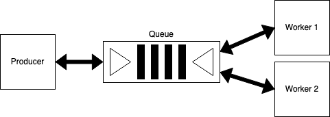
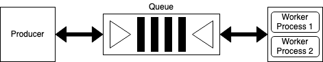
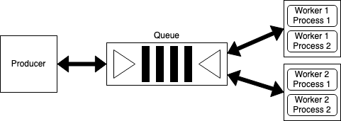

# A Simple, Dockerized Framework for Distributed Tasks
A containerized framework for distributed tasks with RQ and Python. This framework is best for simple queuing services and applications that the developer wants to get off the ground quickly.

See a more detailed discussion in my post [Dockerized Distributed, Asynchronous Work](https://oliviafryt.com/posts/docker_celery_rq.html).

## Technologies:
* Python 3.9
* RQ==1.10.0
* Reddis (latest Docker image)

## Build and Run
``` bash
docker-compose build && docker-compose up -d
```

## Framework
Use this framework to jumpstart your distributed application! Before use, take note of the following:
1. Tasks can be distributed among as many or as few containers as desired, just by adjusting the ```scale``` value in ```docker-compose.yml```. In this example, two worker containers are spawned.
2. The producer and consumer(s) containers must contain the same code base. Note that the entry command of these containers is different, however, in ```docker-compose.yml```.
3. Output from processes managed by supervisord in the **producer** and worker (**worker1** and **worker2**) containers is all set to be redirected to stdout and stderr. This can be changed to a different file or removed entirely in ```producer/conf/supervise-producer.conf``` and ```consumer/conf/supervise-consumer.conf```.
4. In this example, the output of the worker containers displays the output of tasks as they are completed. On the otherhand, the output of the producer container shows the tasks' input arguments and results once they are completed (in other words, their status is updated to either "finished", "stopped", "canceled", or "failed").
4. RQ does not provide innate capabilities to spawn multiple workers inside of one container (unlike Celery). However, this "asynchronousity" can be achieved by adding ```numprocs``` to the consumer's supervisord configuration file therefore having supervisord run/manage multiple of the same process in the container. For example, by adding ```numprocs=5``` to ```app/conf/supervise-consumer.conf```, supervisord will spwan 5 RQ worker processes within each worker container.

## Distributed Work
This work structure is already achieved by this framework.



## Asynchronous Work
This work structure can be achieved by this framework with a multiple number of processes set with supervisord.



## Distributed and Asynchronous Work
This work structure can be achieved by this framework with a multiple number of processes set with supervisord.


